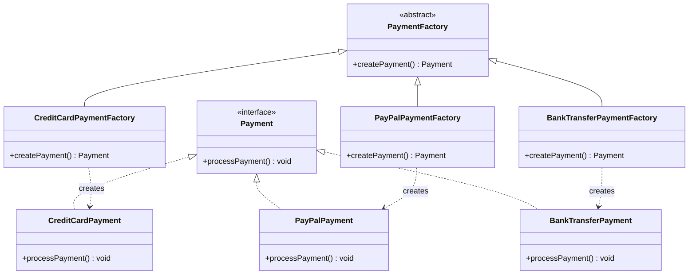

# Sistema de gestión de pagos

## Diagrama de Clase

### Explicación de cada clase

- **`Payment` (interfaz)**: Define el contrato que todas las clases de métodos de pago deben seguir.
- **Clases concretas de métodos de pago (`CreditCardPayment`, `PayPalPayment`, `BankTransferPayment`)**: Implementan la interfaz `Payment` y proporcionan la funcionalidad para procesar el pago.
- **`PaymentFactory` (clase abstracta)**: Proporciona un método `createPayment()` que es sobrescrito por las clases concretas.
- **Clases concretas de fábrica (`CreditCardPaymentFactory`, `PayPalPaymentFactory`, `BankTransferPaymentFactory`)**: Implementan el método `createPayment()` para retornar instancias de la clase de pago correspondiente.
